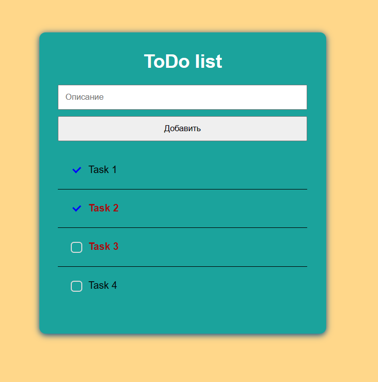

# toDoLisl

---

Right-click on a task to make the task important. 
Ctr + Right-click on a task to delete.

---

I created this application from a video tutorial on [YouTube](https://www.youtube.com/watch?v=6A51fI5QoUM&ab_channel=GloAcademy)
